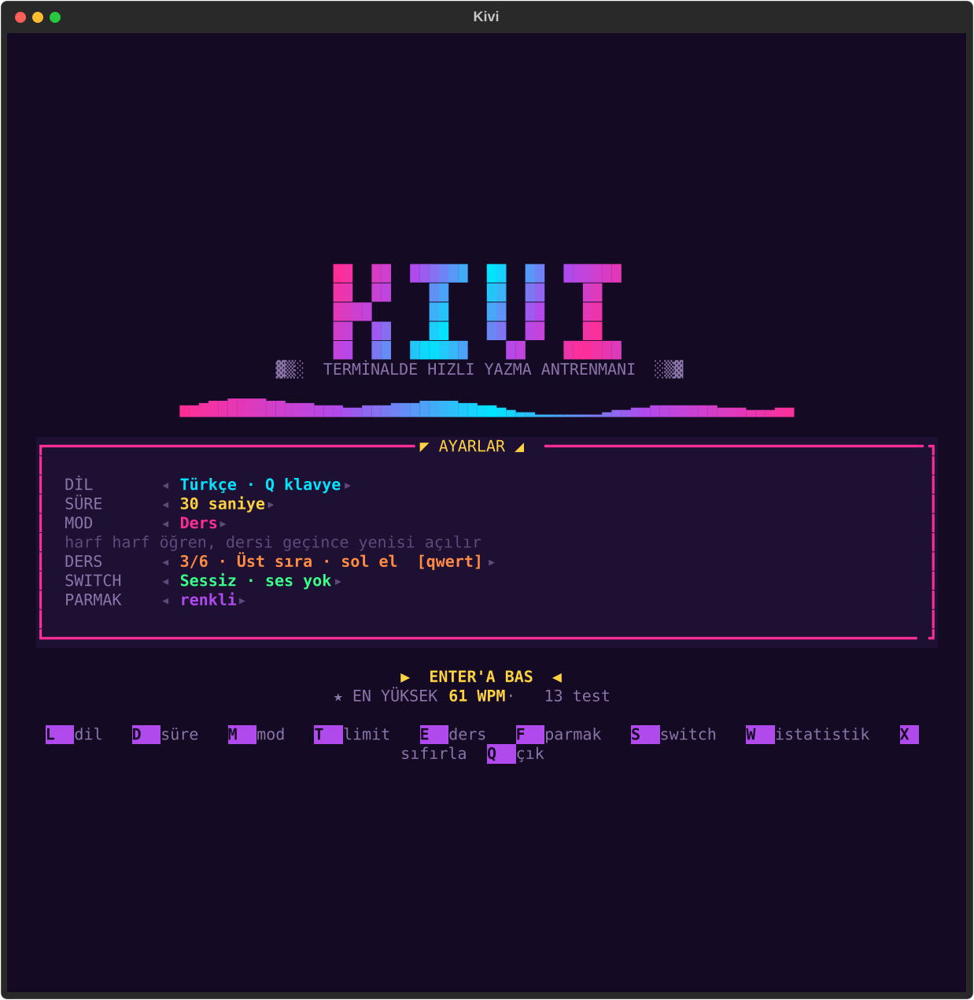
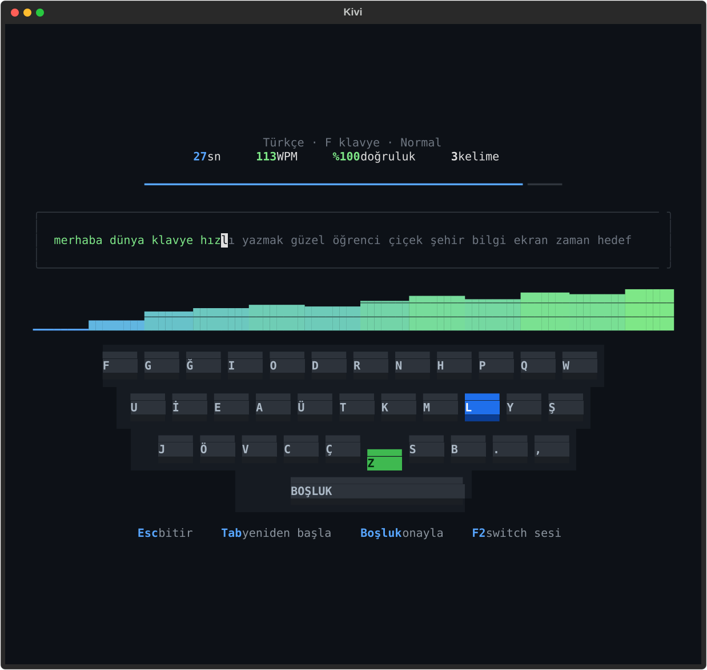
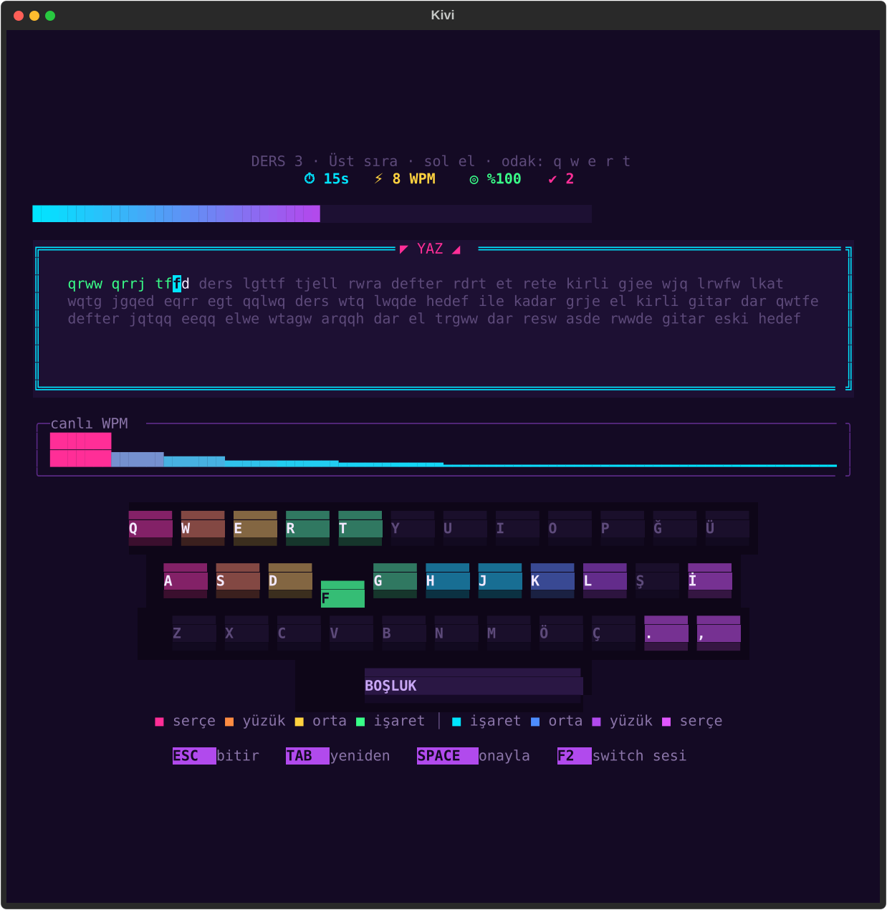
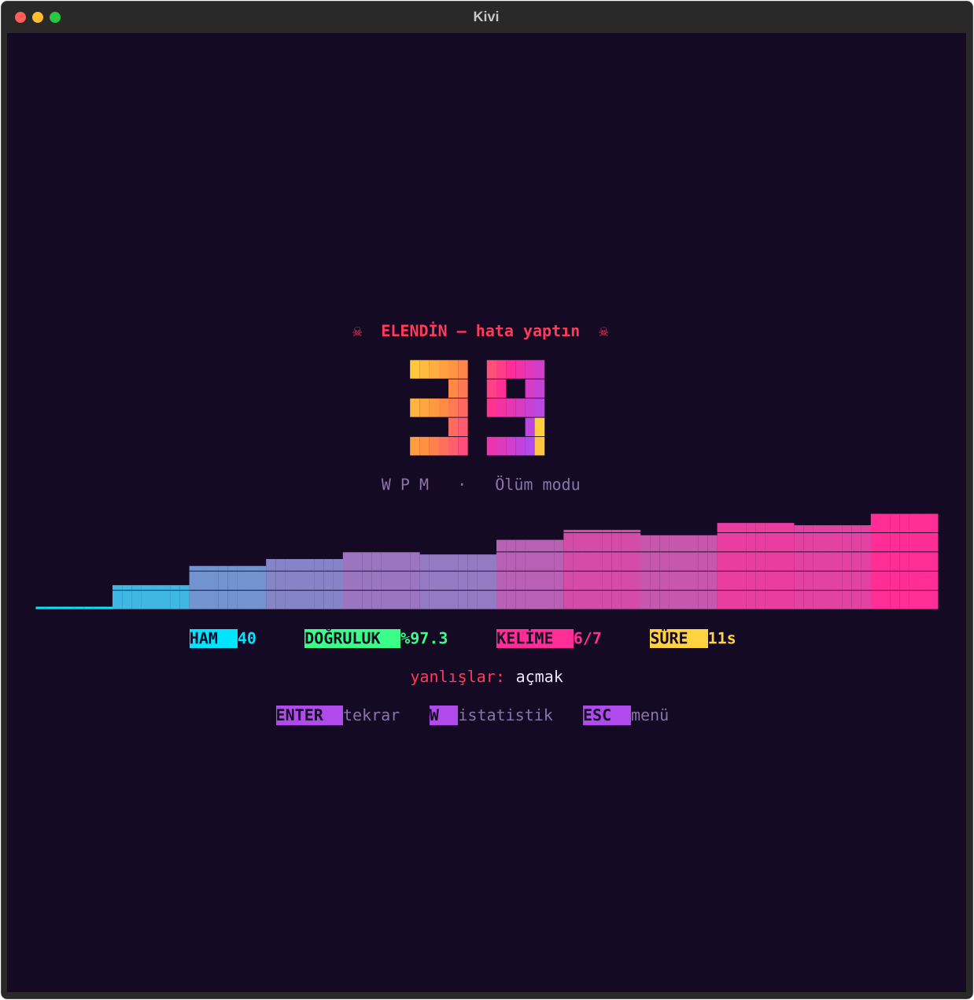
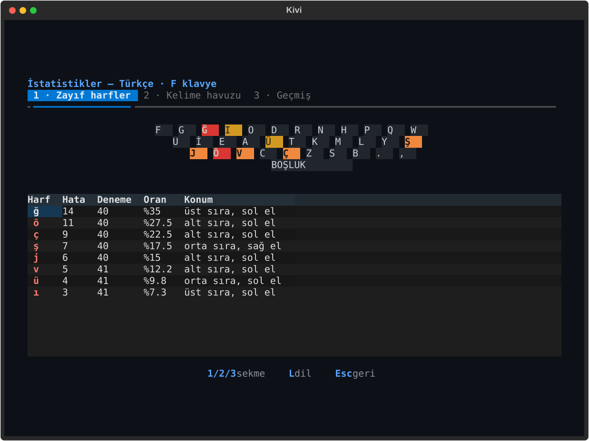
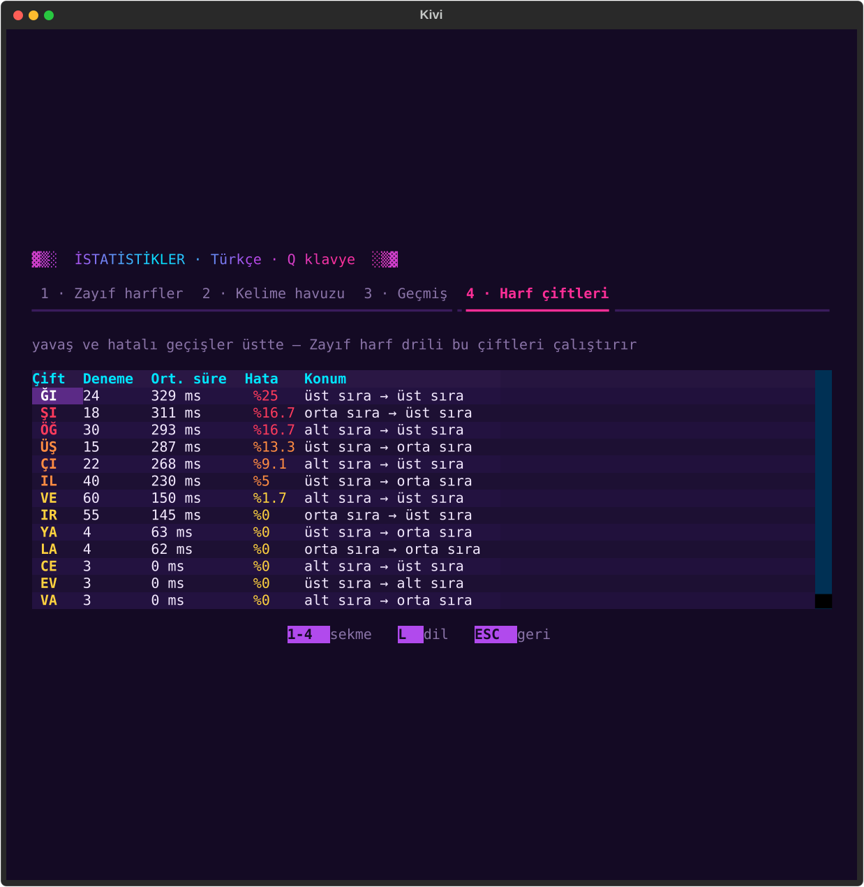

# ⌨️ Kivi — Terminalde Hızlı Yazma Testi

Gerçek zamanlı, renkli ve canlı bir terminal arayüzüne sahip yazma hızı testi.
Yazdıkça **canlı WPM grafiği** çizilir, **ekran klavyesi** sıradaki tuşu gösterir,
yanlışlarını ve zayıf harflerini hatırlayıp sana özel alıştırma yaptırır.

<p align="center">
  
  
</p>
<p align="center">
  
  
</p>
<p align="center">
  
  
</p>

> Görseller sentetik demo verisiyle üretilmiştir; kişisel veri içermez
> (`python tools/screenshots.py`).

## Kurulum ve çalıştırma

```bash
pip install -r requirements.txt
python typing_test.py
```

Renkler siyah-beyaz görünüyorsa: ortamda `NO_COLOR` ayarlıdır. Kivi bunu otomatik yok sayar;
terminalin renk modunu elle seçmek için `python typing_test.py --color 256` (veya `truecolor`, `16`) kullan.
`--no-color` tek renkli görünüm sağlar.

Python 3.9+ ve renk destekleyen bir terminal (Windows Terminal, PowerShell, iTerm2, …)
yeterlidir. Ses için Linux'ta `paplay`/`aplay`/`play` komutlarından biri gerekir. Terminal 40+ satırsa klavye yüksek (3 satırlık) tuşlarla çizilir. IDE çıktı panelinde değil, gerçek bir terminalde çalıştır.

## Özellikler

- 🌆 **Retro / synthwave tema** — neon renkler, animasyonlu gradyan logo, akan ses dalgası, akıcı süre çubuğu; tuşlar basılınca yanıp söner, sıradaki tuş nabız gibi parlar.
- ⏱️ **Süre ayarlı test** — 15 / 30 / 60 / 120 sn. Süre ilk tuşa basınca başlar.
- 📈 **Canlı WPM grafiği** ve doğruluk göstergesi, ilerleme çubuğu.
- 🎹 **Mekanik klavye görünümü** — gölgeli tuş başlıkları, Türkçe Q klavye ve QWERTY; sıradaki tuş mavi, yanlış basılan tuş kırmızı yanar, bastığın tuş aşağı iner.
- 🔊 **Mekanik switch sesleri** — Mavi (clicky), Kırmızı (lineer), Kahverengi (tactile), Siyah (derin thock) veya sessiz. Sesler ek paket gerektirmeden otomatik üretilir; boşluk ve silme tuşunun sesi farklıdır.
- 🇹🇷 / 🇬🇧 **İki dil** — Türkçe (Q klavye) ve İngilizce (QWERTY).
- 🔥 **Zayıf harf ısı haritası** — hata oranına göre klavye üzerinde boyanır; tablo tuşun
  konumunu (sıra / el) da söyler.
- 🎯 **Alıştırma modu** — yanlış yazdığın kelimeler ve zayıf harf içerenler daha sık çıkar.
- 🔤 **Harf çifti analizi** — "ğı", "şı", "ıl" gibi geçişlerde ne kadar yavaş ve hatalı olduğunu gösterir.
- 🗂️ **Kelime havuzu ve geçmiş** — yanlış kelimeler, son testler ve rekor takibi (🏆).

## Modlar

Menüde `M` ile değiştirilir.

| Mod | Ne yapar |
|-----|----------|
| **Normal** | Rastgele kelimeler, süre dolunca biter. |
| **Alıştırma** | Yanlış yazdığın kelimeler ve zayıf harf içerenler daha sık çıkar. |
| **Zayıf harf drili** | Sabit 30 sn. Zayıf harflerin ve yavaş/hatalı **harf çiftlerin** yoğun olduğu özel bir set; veri yoksa normal kelimeler. |
| **Hata düzeltmeli** | Yanlış yazılan kelime düzeltilmeden `Boşluk` ile geçilemez. |
| **Ölüm modu** ☠ | İlk hatada (yanlış, eksik ya da fazla harf) test biter. |
| **Hız limiti** ⚡ | İlk 8 sn tolerans; sonra son 5 sn'deki hızın limitin (`T` ile 20–80 WPM) altına düşerse test biter. |
| **Ders** | Harfleri sırayla öğretir (ana sıra → üst sıra → alt sıra → ğ ü ş ö ç). Henüz açılmamış tuşlar soluk görünür, tuşlar basılacak **parmağa göre renklenir**. Ders geçmek için en az %90 doğruluk ve 8 doğru kelime gerekir; geçince sonraki ders açılır (`E` ile ders seç). |

Elenerek biten testler "en yüksek WPM" rekoruna sayılmaz. Parmak renkleri diğer modlarda `F` ile açılır.
Seçtiğin dil, süre, mod, switch ve ders ilerlemesi kaydedilir.

## Kısayollar

| Ekran | Tuş | İşlev |
|-------|-----|-------|
| Menü | `Enter` / `L` / `D` / `M` | Başla / dil / süre / mod değiştir |
| Menü | `T` / `E` / `F` | Hız limiti / ders seç / parmak renkleri |
| Menü | `S` / `W` / `X` / `Q` | Switch sesi / istatistik / verileri sıfırla / çıkış |
| Test | `Boşluk` | Kelimeyi onayla (boşken yok sayılır) |
| Test | `Backspace` / `Tab` / `Esc` | Sil / yeniden başla / bitir ve sonucu gör |
| Test | `F2` | Switch sesini değiştir |
| İstatistik | `1` `2` `3` `4` / `L` / `Esc` | Sekme (harfler, havuz, geçmiş, harf çiftleri) / dil / geri |

## Puanlama

- **WPM** = doğru karakter / 5 / geçen dakika. Süre dolmadan `Esc` ile bitirirsen gerçek geçen süre kullanılır.
- **Doğruluk** = doğru basılan tuş / toplam basılan tuş (düzeltilen hatalar da sayılır).
- Atlanan harfler, fazladan basılan karakterler ve yarım kalan son kelime hesaba katılır.

## Dosyalar

| Dosya | Görevi |
|-------|--------|
| `typing_test.py` | Giriş noktası |
| `theme.py` | Retro palet, gradyanlar, büyük harf fontu, neon klavye çizimi |
| `ui.py` | Textual arayüzü: menü, test, sonuç, istatistik |
| `sound.py` | Switch seslerini sentezler ve çalar (Windows: winsound, macOS: afplay, Linux: paplay/aplay) |
| `engine.py` | Terminalden bağımsız test mantığı (`Session`) |
| `storage.py` | İstatistik/havuz kaydı ve analiz (JSON) |
| `words.py` | Türkçe ve İngilizce kelime havuzları |
| `layouts.py` | Türkçe Q ve İngilizce QWERTY konumları, parmak eşlemesi, dersler |
| `tools/screenshots.py` | README görsellerini üretir |
| `tests/` | Birim testleri (`python -m unittest discover tests`) |
| `data/` | Kayıtlı istatistikler (otomatik oluşur, git'e eklenmez) |
